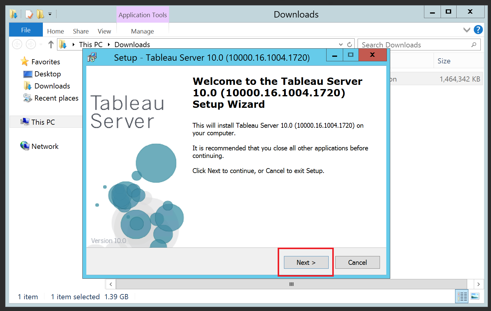
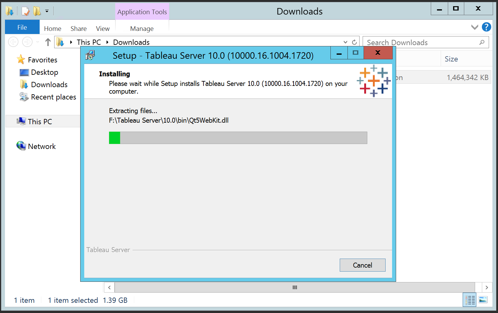
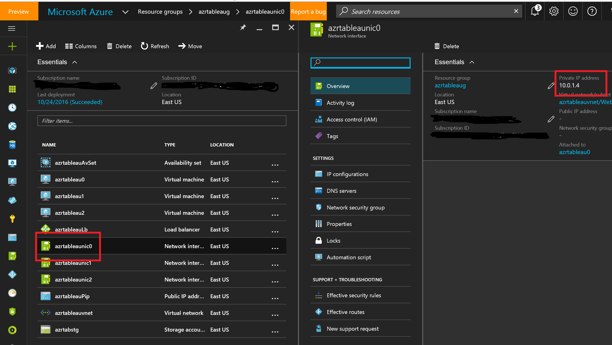

#Creating a Tableau Server Cluster on Azure

## Overview of the process
- **Step 1.** Deploy Azure Resource Manager Template to create VMs and Networking.
- **Step 2.** Login to Primary Server, download and install Tableau Primary Networked Server.
- **Step 3.** Login to each Worker Server, download, install and configure Tableau Worker Networked Server.
- **Step 4.** Use Tableau Server Configuration on Primary Networked Server to setup and configure Worker Networked Servers.

###Pre-Requisites
- If you don't have an Azure account, you can create one [here] (https://azure.microsoft.com/en-us/free/)
- Edit the Azure Resource Manager (ARM) Template (azuredeploy.json) and/or ARM Template Parameters (azuredeploy.parameters.json) to customize any values you would like to change.  
- **Note:** minimum recommended VM Size is DS13.
- For more on deploying ARM Templates, see [here] (https://azure.microsoft.com/en-us/documentation/articles/resource-group-template-deploy/)

## Step 1
### Deploy Azure Resource Manager Template to create VMs and Networking
**From the Azure CLI, execute the following commands:**

    /* Login to your Azure account
    Azure login

    /* List the accounts you have access to
    azure account list

    /* If your preferred subscription isn't set to default, use this command to set the right one
    azure account set <YourSubscriptionNameOrId>

    /* You can name your Resource Group however you prefer
    /* Choose the region of your preference
    azure group create -n azrtableaug -l "East US"

    /* Validate your customization of the template and parameters
    azure group template validate -f azuredeploy.json -e "azuredeploy.parameters.json" azrtableaug

    /* Deploy the template
    azure group deployment create -f azuredeploy.json -e "azuredeploy.parameters.json" -g azrtableaug

###  Once succesful,  your deployment will report an asset list similar to the following:   
    data:    DeploymentName     : azuredeploy
    data:    ResourceGroupName  : azrtableaug
    data:    ProvisioningState  : Succeeded
    data:    Timestamp          : Mon Oct 24 2016 11:59:33 GMT-0400 (Eastern Daylight Time)
    data:    Mode               : Incremental
    data:    CorrelationId      : 37eaa21f-f84c-45bb-890e-f5ccd2489510
    data:    DeploymentParameters :
    data:    Name                   Type          Value
    data:    ---------------------  ------------  ------------------------------------------------------------------
    data:    vmPrefix               String        azrtableau
    data:    vmSize                 String        Standard_DS13
    data:    dataDiskSize           String        128
    data:    adminUsername          String        VMAdmin
    data:    adminPassword          SecureString  undefined
    data:    location               String        East US
    data:    newStorageAccountName  String        azrtabstg
    data:    imagePublisher         String        MicrosoftWindowsServer
    data:    imageOffer             String        WindowsServer
    data:    imageSKU               String        2012-R2-Datacenter
    data:    initScriptUrl          String        https://isaacsgi.blob.core.windows.net/extensions/stripedrives.ps1
    data:    initScript             String        stripedrives.ps1
    info:    group deployment create command OK

License Key

## Step 2
### Login to Primary Server, download and install Tableau Primary Networked Server

1. Sign in to the [Azure  portal](https://portal.azure.com).
2. Navigate to the Resource Group you created
 

3.  Connect to Primary Server via Remote Desktop
 

4.  Select 'Local Server' on Server Manager
    (Say 'yes' to finding PCs, devices and content on this network)
 

5.  Turn off IE Enhanced Security Configuration
 

6.  Turn off Windows Firewall (Private and Public)

7.  Open Internet Explorer - Use recommended security, privacy, and compatibility settings

8.  Navigate to [Tableau Alternate Downloads Site](http://www.tableau.com/support/esdalt)

9.  Download Primary Networked Server: latest release of Tableau Server version 10.0 (TableauServer-64bit-10-0-2.exe)

10.  Locate 'TableauServer-64bit-10-0-2.exe' on drive, double-click to initiate install, select 'Run', 'Next'

11.  Change install location to striped drive [TableauData (F:)], 'ok', then 'Next'

12. Installing ...

13. System Verification, then 'Next'

14. Accept End User License Agreement, then 'Next'

15. Accept default Start Menu folder, then'Next'

 
 then 'Install'

16. Configuration and Initialization, then 'Next'

This process may take several minutes to complete ...

17. Activate with license key

18. No changes on Tableau Server Configuration.  Click 'ok', then 'ok', then Internet Explorer launches

19. Create Server Administrator account

Tableau Administrator page opens

20. Close IE, then 'Finish'

##Step 3
###Login to each Worker Server, download, install and configure Tableau Worker Networked Server
On Each Worker, follow actions 1 - 14 above, making sure to install the Worker Networked Server.  During the Worker installation, the only Tableau Server Worker software configuration is to supply the IP address of the Primary Networked Server.

Key Screenshots for this Step:

* Make sure you're dowloading latest release of **Tableau Server Worker** version 10.0 (TableauServerWorker-64bit-10-0-2.exe) the Worker

* Tableau Server Worker Configuration requires that you supply the Private IP Address of the Primary Networked Server

* The Private IP Adress of the Primary Networked Server can be retrieved from the Network Interface (Nic) of the Primary Networked Server

##Step 4
###Use Tableau Server Configuration on Primary Networked Server to setup and configure Worker Networked Servers

21. Add Server Directory to System Environmental Path
    a.  Right-click on 'This PC'
    b.  Properties
    c.  'Advanced system settings'
    d.  'Environment Variables...'
    e.  'System variable', select 'Path', 'Edit...'
    f.  at end of Variable value field, add ;f:\Tableau Server\bin    
    g.  'ok', 'ok', 'ok'
19. Windows Key + 'x'
20. Command Prompt (Admin)
21. Tabadmin stop
22. Windows Key, Down Arrow to 'Apps', Configure Tableau Server
23.  

Install

Primary Networked Server

Worker Networked Server