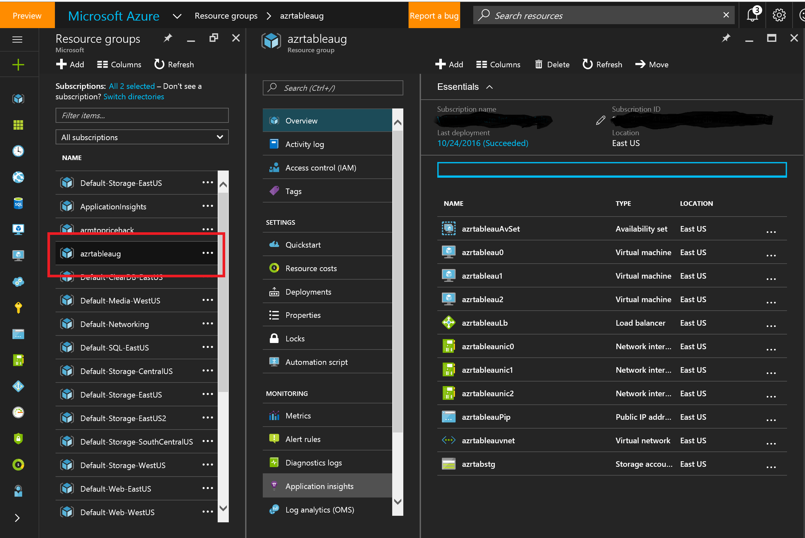
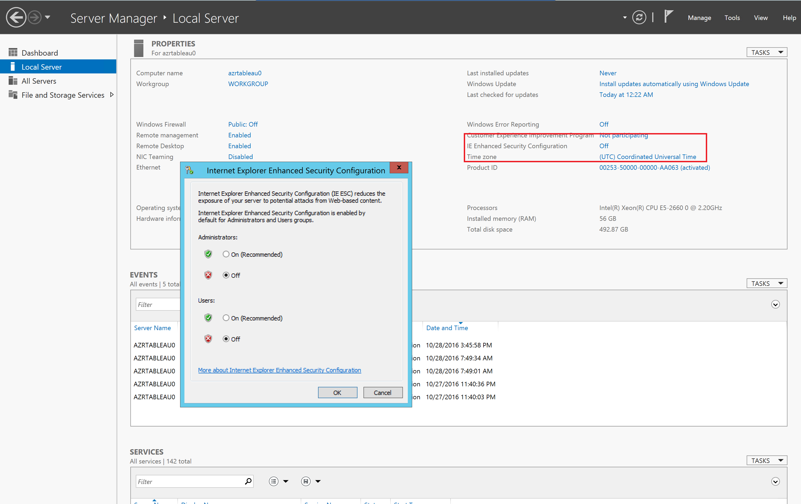
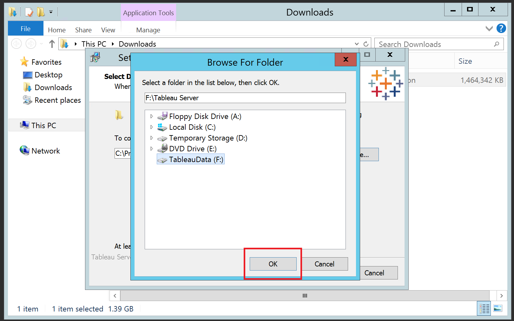
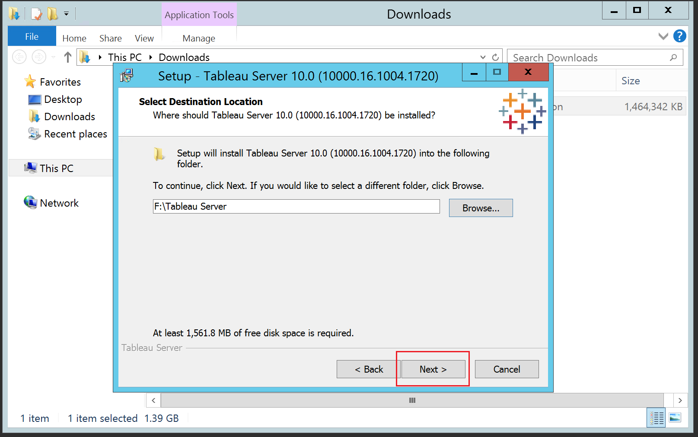
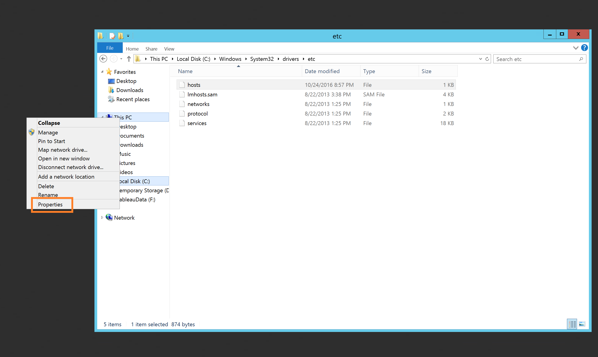
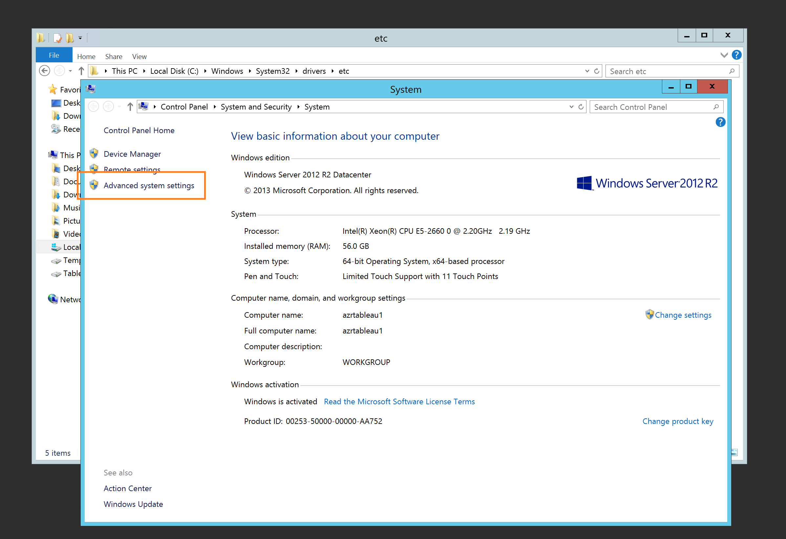
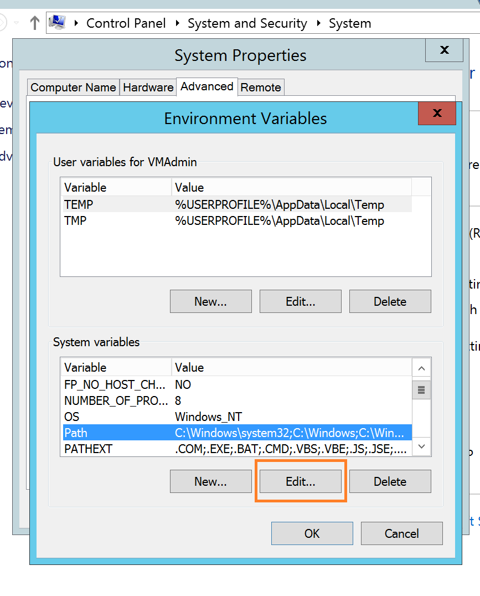
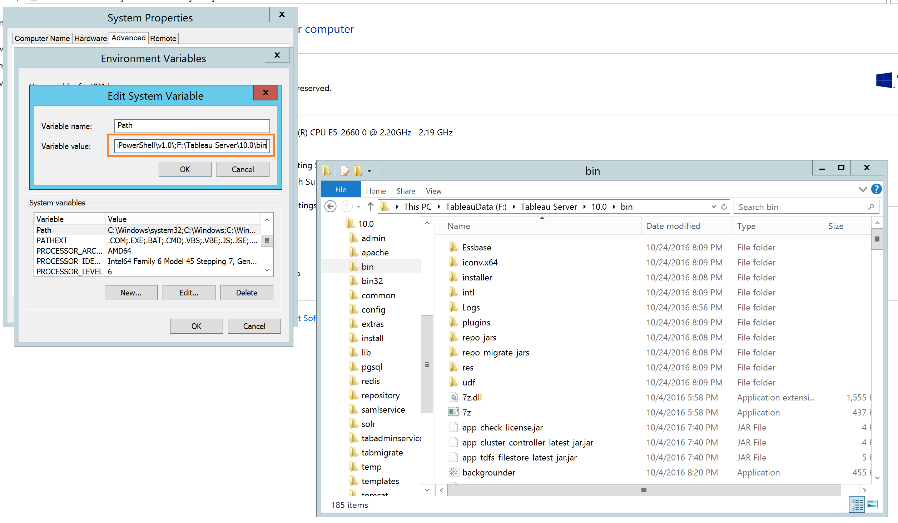

#Creating a Tableau Server Cluster on Azure

This is a detailed guide for creating a Tableau cluster on Microsoft's Azure cloud.  For more information about running Tableau Server in a distributed environment, please see [here] (http://onlinehelp.tableau.com/current/server/en-us/help.htm#qs_distributed_server.html)

## Overview of the process
- **Step 1.** Deploy Azure Resource Manager Template to create VMs and Networking.
- **Step 2.** Login to Primary Server, download and install Tableau Primary Networked Server.
- **Step 3.** Login to each Worker Server, download, install and configure Tableau Worker Networked Server.
- **Step 4.** Use Tableau Server Configuration on Primary Networked Server to setup and configure Worker Networked Servers.

###Pre-Requisites
1. If you don't have an Azure account, you can create one [here] (https://azure.microsoft.com/en-us/free/)
2. Install either:
[Azure PowerShell cmdlets on Windows] (https://docs.microsoft.com/en-us/powershell/azureps-cmdlets-docs/); OR
[The Azure Cross-Platform CLI] (https://docs.microsoft.com/en-us/azure/xplat-cli-install)
3. Edit the Azure Resource Manager (ARM) Template (azuredeploy.json) and/or ARM Template Parameters (azuredeploy.parameters.json) to customize any values you would like to change.  
- **Note:** minimum recommended VM Size is DS13.
- For more on deploying ARM Templates, see [here] (https://azure.microsoft.com/en-us/documentation/articles/resource-group-template-deploy/)

## Step 1
### Deploy Azure Resource Manager Template to create VMs and Networking

**If you're using PowerShell, execute the following commands:**

    /* Login to your Azure account
    Add-AzureRmAccount

    /* List the Subscriptions you have access to
    Get-AzureRmSubscription

    /* If your preferred subscription isn't set to default, use this command to set the right one
    Set-AzureRmContext -SubscriptionName <YourSubscriptionName>

    /* You can **name your Resource Group** however you prefer
    /* Choose the **region of your preference**
    New-AzureRmResourceGroup -Name azrtableaugx -Location "East US"

    /* Validate your customization of the template and parameters
    Test-AzureRmResourceGroupDeployment -ResourceGroupName azrtableaugx -Template File azuredeploy.json -TemplateParameterFile azuredeploy.parameters.json -Verbose

    /* Deploy the template
    New-AzureRmResourceGroupDeployment -ResourceGroupName azrtableaupsg -Template File azuredeploy.json -TemplateParameterFile azuredeploy.parameters.json -Verbose

###  Once succesful,  your deployment will report an asset list similar to the following:       
    DeploymentName          : azuredeploy
    ResourceGroupName       : azrtableaugx
    ProvisioningState       : Succeeded
    Timestamp               : 2/14/2017 5:33:34 PM
    Mode                    : Incremental
    TemplateLink            :
    Parameters              :
                              Name             Type                       Value
                              ===============  =========================  ==========
                              vmPrefix         String                     azrtableaugx
                              vmSize           String                     Standard_DS13
                              dataDiskSize     String                     128
                              adminUsername    String                     VMAdmin
                              adminPassword    SecureString
                              location         String                     East US
                              newStorageAccountName  String               azrtabstgxx
                              imagePublisher   String                     MicrosoftWindowsServer
                              imageOffer       String                     WindowsServer
                              imageSKU         String                     2012-R2-Datacenter
                              initScriptUrl    String                        https://isaacsgi.blob.core.windows.net/extensions/stripedrives.ps1
                              initScript       String                     stripedrives.ps1

    Outputs                 :
    DeploymentDebugLogLevel :

** If you're using the Azure CLI, execute the following commands:**

    /* Login to your Azure account
    Azure login

    /* List the accounts you have access to
    azure account list

    /* If your preferred subscription isn't set to default, use this command to set the right one
    azure account set <YourSubscriptionNameOrId>

    /* You can name your Resource Group however you prefer
    /* Choose the region of your preference
    azure group create -n azrtableaug -l "East US"

    /* Validate your customization of the template and parameters
    azure group template validate -f azuredeploy.json -e "azuredeploy.parameters.json" azrtableaug

    /* Deploy the template
    azure group deployment create -f azuredeploy.json -e "azuredeploy.parameters.json" -g azrtableaug

###  Once succesful,  your deployment will report an asset list similar to the following:   
    data:    DeploymentName     : azuredeploy
    data:    ResourceGroupName  : azrtableaug
    data:    ProvisioningState  : Succeeded
    data:    Timestamp          : Mon Oct 24 2016 11:59:33 GMT-0400 (Eastern Daylight Time)
    data:    Mode               : Incremental
    data:    CorrelationId      : 37eaa21f-f84c-45bb-890e-f5ccd2489510
    data:    DeploymentParameters :
    data:    Name                   Type          Value
    data:    ---------------------  ------------  ------------------------------------------------------------------
    data:    vmPrefix               String        azrtableau
    data:    vmSize                 String        Standard_DS13
    data:    dataDiskSize           String        128
    data:    adminUsername          String        VMAdmin
    data:    adminPassword          SecureString  undefined
    data:    location               String        East US
    data:    newStorageAccountName  String        azrtabstg
    data:    imagePublisher         String        MicrosoftWindowsServer
    data:    imageOffer             String        WindowsServer
    data:    imageSKU               String        2012-R2-Datacenter
    data:    initScriptUrl          String        https://isaacsgi.blob.core.windows.net/extensions/stripedrives.ps1
    data:    initScript             String        stripedrives.ps1
    info:    group deployment create command OK

### For both methods, you can check the progress and final status of the deployment in the [Azure  portal] (https://portal.azure.com)
1. Select Resource Groups, then the Resource Group you created, then select "Deploying"

## Step 2
### Login to Primary Server, download and install Tableau Primary Networked Server

1. Sign in to the [Azure  portal](https://portal.azure.com).
2. Navigate to the Resource Group you created
 

3.  Connect to Primary Server via Remote Desktop
 

4.  Select 'Local Server' on Server Manager
    (Say 'yes' to finding PCs, devices and content on this network)
 

5.  Turn off IE Enhanced Security Configuration
 

6.  Turn off Windows Firewall (Private and Public)

7.  Open Internet Explorer - Use recommended security, privacy, and compatibility settings

8.  Navigate to [Tableau Alternate Downloads Site](http://www.tableau.com/support/esdalt)

9.  Download Primary Networked Server: latest release of Tableau Server version 10.0 (TableauServer-64bit-10-0-2.exe)

10.  Locate 'TableauServer-64bit-10-0-2.exe' on drive, double-click to initiate install, select 'Run', then 'Next'

11.  Select 'Browse' to change install location to striped drive [TableauData (F:)], then 'ok', then 'Next'

12. Installing ...

13. System Verification, then 'Next'

14. Accept End User License Agreement, then 'Next'

15. Accept default Start Menu folder, then'Next'

 
 then 'Install'

16. Configuration and Initialization, then 'Next'

 This process may take several minutes to complete ...

17. Activate with license key

18. No changes on Tableau Server Configuration.  Click 'ok', then 'ok', then Internet Explorer launches

19. Create Server Administrator account

Create your login and **make sure to save this information**

 Tableau Administrator page opens

20. Close Internet Exporer, then 'Finish' Tableau Server Setup Wizard

##Step 3
###Login to each Worker Server, download, install and configure Tableau Worker Networked Server
On Each Worker, follow actions 1 - 14 above, making sure to install the Worker Networked Server.  During the Worker installation, the only Tableau Server Worker software configuration is to supply the IP address of the Primary Networked Server.

Key Screenshots for this Step:

* Make sure you're dowloading latest release of **Tableau Server Worker** version 10.0 (TableauServerWorker-64bit-10-0-2.exe) the Worker

* Tableau Server Worker Configuration requires that you supply the Private IP Address of the Primary Networked Server

* The Private IP Adress of the Primary Networked Server can be retrieved from the Network Interface (Nic) of the Primary Networked Server

##Step 4
###Use Tableau Server Configuration on Primary Networked Server to setup and configure Worker Networked Servers

###Step 4 Overview
- **Step 4.1.** Add Server Directory to System Environmental Path 
- **Step 4.2.** Stop Tableau Admin Server
- **Step 4.3.** Launch Tableau Server Configuration
- **Step 4.4.** Add Worker Networked Servers to the Configuration
- **Step 4.5.** Primary Networked Server pushes configurations to Worker Networked Servers
- **Step 4.6.** Access your Tableau portal

###Configuration Pre-Requisite: Set 'hosts' files to see other servers
The Hostnames and Private IP Adresses must be set in the Windows hosts files so each server can see the others as follows:
* The Primary's Hostnames and Private IP Adress should be set in each file.
* The **Primary** should have the Hostname and Private IP Address of each Worker.
* Each **Worker** should have the Hostname and Private IP Adress of the Primary **AND the other Worker.**

See sample hosts files in ./scripts directory of this project.

The hosts file can be found in this directory on each machine:   **`c:\Windows\System32\drivers\etc\`**

###Tableau Server Configuration on Primary Networked Server

###4.1. Add Server installation Directory to System Environmental Path

 Right-click on 'This PC', select 'Properties'
 

 System properties, 'Advanced system settings'
 

 'Environment Variables...'
 

 'System variables', Select 'Path', then 'Edit...'
 

 At end of 'Variable value' field, add `;f:\Tableau Server\bin`, then 'ok', 'ok', 'ok'
 

###4.2. Stop Tableau Admin Server
 Windows Key + 'x',  Command Prompt (Admin)
 ")

 Enter 'Tabadmin stop' 
 

###4.3. Launch Tableau Server Configuration

 While waiting for Tableau Server to stop, hit Windows Key, Click on Down Arrow to 'Apps'
 

 Select Configure Tableau Server
 
 
 Tableau Server Configuration launches
 

###4.3. Add (2x) Worker Networked Servers to the Configuration

  Select 'Servers' Tab
  

  Click on 'Add...'
  

  Settings as follows:
  - Use the Private IP Address (as in Step 4 Pre-Requisite) to identify a Worker Server VM
  - VizSQL Server: 2
  - Application Server: 1
  - Backgrounder: 1
  - Cache Server: 2
  - Data Server: 2
  - Data Engine: 1
  - **Repository: ONLY Check for first Worker Networked Server**
  - Gateway: Check
  - Search & Browse: Check

  

 After adding BOTH Worker Networked Servers, your Tableau Server Configuration will look like the following:
 

###4.5. Primary Networked Server pushes configurations to Worker Networked Servers

 Click 'ok', then Tableau Server Configuration will update the Workers.  This can take 10 - 15 minutes.

 There will be notification messages for each step as follows:
 - Build admin Installer bundle
 - Send admin bundle
 - Upgrade administrative server on Worker
 - Restart administrative server on Worker
 - Build software installer bundle for workers
 - Send software bundle to Worker
 - Wait for Worker to finish installing
 - Configure Workers
 - Rebuild search index

 NOTE - you may need to move the Tableau Server Configuration windows to see the notifications that will look like this:
 
 
 In an Admin Command Window, type `Tabadmin Start`

###4.6. Access your Tableau portal

  Go to portal.azure.com and select the Primary Server, and copy the Public IP Address/DNS name label value
  

  Open a browser and past the value, but remove the IP Address.  Navigate to the Tableau Admin Login
  

  If you have remembered your login correctly **(Step 2.19 above)**, you will now have access to the Tableau Portal 
  